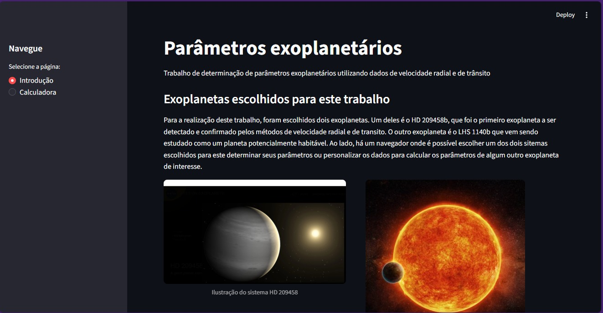

CALCULADORA DE PARÂMETROS EXOPLANETÁRIOS

Aplicação desenvolvida em Python com Streamlit para o cálculo e análise de parâmetros físicos e orbitais de exoplanetas, com foco educacional e científico.
O projeto permite explorar relações entre propriedades planetárias e estelares, facilitando a compreensão de conceitos fundamentais da astrofísica de exoplanetas por meio de uma interface interativa.

  

--------------------------------------------------

Funcionalidades

- Cálculo de parâmetros exoplanetários a partir de dados de entrada
- Interface interativa desenvolvida com Streamlit
- Organização clara da lógica de cálculo
- Apresentação simplificada dos resultados
- Aplicação voltada para aprendizado e análise científica

--------------------------------------------------

Tecnologias utilizadas

- Python
- Streamlit
- Bibliotecas científicas (NumPy, Pandas)
- Git e GitHub para versionamento

----------------------------------------------------------------------------------------------------

* Contexto do projeto

Este projeto foi desenvolvido no contexto acadêmico da graduação em Astrofísica, com o objetivo de aplicar programação na resolução de problemas científicos e na análise de dados astronômicos.
Além do aspecto científico, o projeto reforça boas práticas de programação, estruturação de código e desenvolvimento de aplicações interativas.

----------------------------------------------------------------------------------------------------

* Como executar o projeto

1. Clone o repositório:
git clone https://github.com/sabrenda7/sistemas-planet-rios.git

2. Instale as dependências:
pip install -r requirements.txt

3. Execute a aplicação:
streamlit run app.py

----------------------------------------------------------------------------------------------------

Aprendizados

- Desenvolvimento de aplicações interativas com Streamlit
- Aplicação de lógica e modelagem científica em código
- Organização e clareza na implementação de cálculos
- Integração entre ciência de dados e desenvolvimento back-end

----------------------------------------------------------------------------------------------------

Autora:
Brenda Sa
Graduanda em Astrofísica e Desenvolvedora Back-End Jr | 
GitHub: https://github.com/sabrenda7
